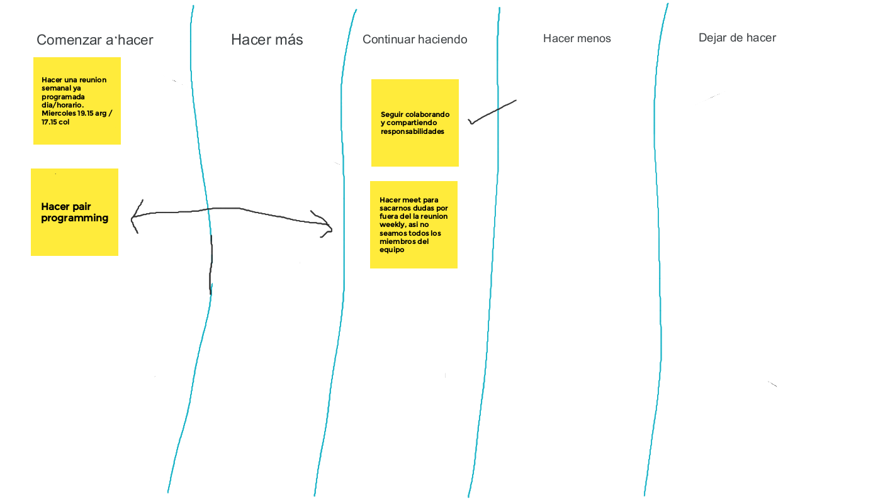

# Resumén de Scrum Retrospective - 01/07/2023 

>Nuestro retrospective board 

El equipo #6 se reunió primero de julio para reunir experiencias con el objetivo de mejorar su eficiencia. Luego de un sesión de colaboración en el retrospective board, llegamos a las siguientes conclusiones: 

1. No usamos scrum para el primer sprint. Nos comprometimos a aplicar la metodología de ahora en adelante.
2. Acordamos hacer una daily scrum semanal, de ahora en adelante llamada *weekly scrum*.
3. Buscamos mejorar la colaboración del grupo, programando sesiones de pair programming cuando alguno de nuestros compañeros requiera consejo, o nuestros horarios se junten.
4. Dejamos abierta la puerta para realizar más de una weekly scrum de ser necesario. Confiamos en nuestra capacidad de ser flexibles. 

La anterior lista representa la experiencia acumulada por nuestro equipo en el último sprint.

